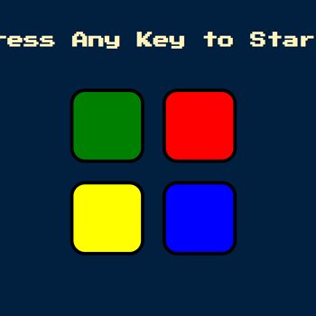

# London App Brewery - Simon Game

This is a solution to the [Simon Game](https://www.udemy.com/course/the-complete-web-development-bootcamp/learn/lecture/12384246) challenge on [Udemy](https://www.udemy.com/course/the-complete-web-development-bootcamp/).

## Table of contents

- [Overview](#overview)
  - [The challenge](#the-challenge)
  - [Screenshot](#screenshot)
  - [Links](#links)
- [My process](#my-process)
  - [Built with](#built-with)
  - [How to install and run](#how-to-install-and-run)
- [Author](#author)

## Overview

### The challenge

"In this challenge module, you will be building a game that is modeled off the game Simon."

### Screenshot



### Links

- Code URL: [Github](https://github.com/cekstedt/LAB-Simon-Game)
- Live Site URL: [Netlify](https://willowy-licorice-a4f905.netlify.app/)
- Challenge URL: [Udemy](https://www.udemy.com/course/the-complete-web-development-bootcamp/learn/lecture/12384246)

## My process

### Built with

- HTML
- CSS
- JS
- Jquery

### How to install and run

First clone the repo and navigate into the directory.
```
git clone https://github.com/cekstedt/LAB-Simon-Game.git
cd LAB-Simon-Game/
```

This project contains javascript, so you must start a local web server to see it function. The following options will serve your `src/` folder to http://localhost:8000/ via Python or NodeJS, respectively.

```
python -m http.server 8000 -d ./src
```

```
npx http-server ./src -p 8000
```

## Author

- [@cekstedt](https://github.com/cekstedt)